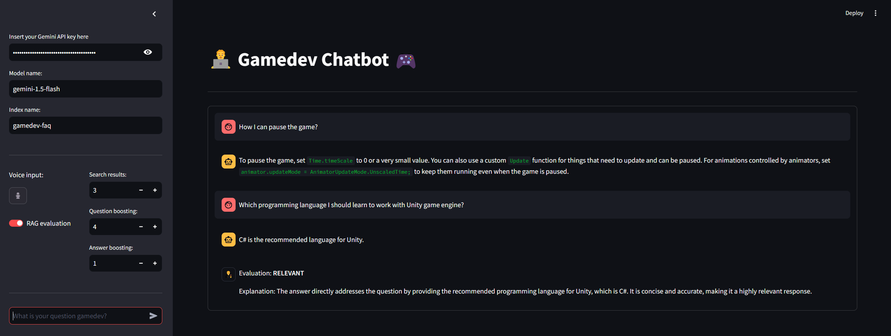

# LLM Zoomcamp 2024 Project

[](https://github.com/psf/black)

# Gamedev Chatbot



## Description

This repository contains the code for a Streamlit-based application that acts as a chatbot specifically designed for Unity game developers. This chatbot leverages a Retrieval Augmented Generation (RAG) framework with a comprehensive knowledge base about the Unity game engine, allowing it to provide helpful and informative responses to your questions. This chatbot was developed to be used as a graded project for the LLM Zoomcamp course.

### Features

* Natural Language Interaction: Communicate with the chatbot in natural language, asking questions about Unity features, best practices, troubleshooting tips, and more.

* Voice Input: Enjoy hands-free interaction by using voice input to ask your questions.

* Comprehensive Knowledge Base: The chatbot's knowledge base encompasses a wide range of Unity topics, from core concepts to advanced techniques.

* Streamlit UI: An intuitive and user-friendly Streamlit interface provides an interactive chat experience.

* RAG-Powered: The chatbot utilizes the power of Retrieval Augmented Generation to provide relevant and accurate information tailored to your specific queries.

## Dataset

In this project we used to following dataset: [Gamedev Chatbot: Domain-oriented intent dataset](https://www.kaggle.com/datasets/antonkozyriev/unity3d-faq). This dataset is based on many questions and answers about Unity game engine. The original format of the dataset is JSONL, but here we converted it to JSON and this version is available on `dataset` folder. 

## How to install

* Python version: 3.12

* Step 1: Clone this repository
```bash
git clone https://github.com/jvscursulim/rag_project_llm_zoomcamp_2024
```

* Step 2: Create and activate a virtual environment
```bash
python -m venv env
```

Linux
```bash
source env/bin/activate
```

Windows
```bash
cd env/Scripts
call activate
```

* Step 3: Install pipenv 
```bash
pip install pipenv
```

* Step 4: Install python libraries
```bash
cd rag_project_llm_zoomcamp_2024
pipenv install
```

## How to do data ingestion

Before to run the application, you need to do the data ingestion. So, in order to do that, you will need to run the python script called `data_ingestion.py`. This python script will ingest the data present on `dataset/gamedev_faq_database.json` into `elasticsearch` index.
```bash
cd rag_project_llm_zoomcamp_2024/src
python data_ingestion.py
```

## How to use

* Step 1: Access [Google AI Studio](https://ai.google.dev/aistudio), login in the studio and click in the button Get API key, we must provide a Gemini API key to use the Gamedev Chatbot.

* Step 2: Intialize docker and open a new terminal and execute the command below to start `elasticsearch`.
```bash
docker run -it \
    --rm \
    --name elasticsearch \
    -p 9200:9200 \
    -p 9300:9300 \
    -e "discovery.type=single-node" \
    -e "xpack.security.enabled=false" \
    elasticsearch:8.4.3
```

* Step 3: Open a new terminal tab, access the `src` folder and initialize the streamlit application.
```bash
cd rag_project_llm_zoomcamp_2024/src
streamlit run app.py
```

* Step 4: Insert your Gemini API key in the streamlit form.

* Step 5: Use the UI created with streamlit to execute your queries.

## Evaluation

### Retrieval

* Step 1: Access the folder `src`
```bash
cd rag_project_llm_zoomcamp_2024/src
```

* Step 2: Intialize docker and open a new terminal and execute the command below to start `elasticsearch`.
```bash
docker run -it \
    --rm \
    --name elasticsearch \
    -p 9200:9200 \
    -p 9300:9300 \
    -e "discovery.type=single-node" \
    -e "xpack.security.enabled=false" \
    elasticsearch:8.4.3
```

* Step 3: Perform data ingestion executing the python script `data_ingestion.py` 
```bash
python data_ingestion.py
``` 

* Step 4: Open the file `generate_ground_truth.py`, insert your Gemini API key there and run the python script.
```bash
python generate_ground_truth.py
```

* Step 5: Run the `retrieval_evaluation.py` python script through the terminal to see retrieval metrics (Hit-rate and MRR)
```bash
python retrieval_evaluation.py
```

Observation: The free Gemini API Key only give us the possibility to generate 16 answers, so in the `ground_truth_retrieval.csv` file we only have 80 generated questions to use for retrieval evaluation.

### RAG

* Step 1: Access the folder `src`
```bash
cd rag_project_llm_zoomcamp_2024/src
```

* Step 2: Intialize docker and open a new terminal and execute the command below to start `elasticsearch`.
```bash
docker run -it \
    --rm \
    --name elasticsearch \
    -p 9200:9200 \
    -p 9300:9300 \
    -e "discovery.type=single-node" \
    -e "xpack.security.enabled=false" \
    elasticsearch:8.4.3
```

* Step 3: Perform data ingestion executing the python script `data_ingestion.py` 
```bash
python data_ingestion.py
``` 

* Step 4: Open the file `generate_ground_truth.py`, insert your Gemini API key there and run the python script.
```bash
python generate_ground_truth.py
```

* Step 5: Run the `rag_evaluation.py` python script through the terminal to see RAG metric, insert your Gemini API key there and run the python script.
```bash
python rag_evaluation.py
```

Observation: The free Gemini API Key only give us the possibility to generate 16 answers, so in the `ground_truth_retrieval.csv` file we only have 80 generated questions to use for retrieval evaluation.

In order to perform a RAG evaluation, we implemented a LLM Judge and it is available on the UI. Then, if the user wants to see the relevance of the LLM answer, it will be necessary to run the streamlit application and enable the RAG evaluation.

## License

This project is licensed under the Apache 2.0 license.

## Disclaimer

This chatbot is for informational purposes only and it was created as project for the LLM Zoomcamp course. It should not be considered a substitute for official documentation or professional advice.
